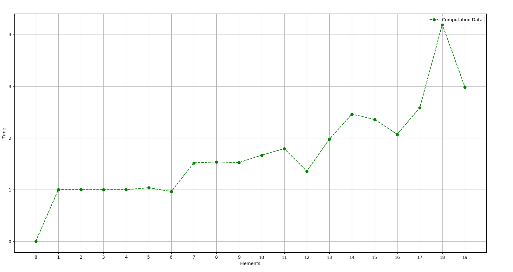
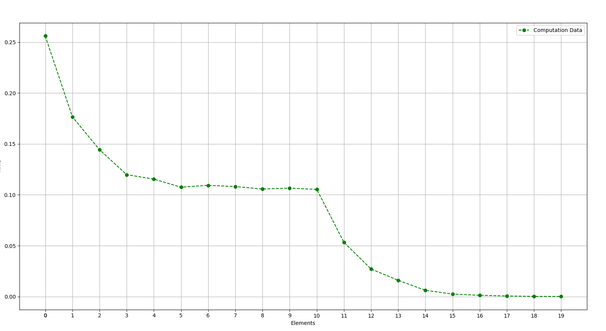

### TLB cache size 

Как и описано в [статье](https://etd.ohiolink.edu/apexprod/rws_etd/send_file/send?accession=osu1308256764&disposition=inline) измерим время обработки N ячеек памяти. \
Как только размер массива перестанет помещаться в линейку кеша, время обработки участка должно заметно вырасти. Это реализовано в функции `f1`. \
Оценить изменения во времени таким образом оказалось довольно сложно, но проще всего увидеть разницу если посмотреть на график `t[i] / t[i - 1]`, то есть отношение времени исполнения для текущего размера массива к времени обработки предыдущего. \
Как видно из графика ниже, переход от 1 наблюдается при N=64. \

Второй подход соотвествует функции `f2` в нем мы обновляем каждый k-тый элемент. Как только k становится больше, чем размер линейки кеша, необходимость загружать все элементы пропадает, поэтому вермя значительно сокращается. На графике ниже видно, что это происходит при k = 1024.

